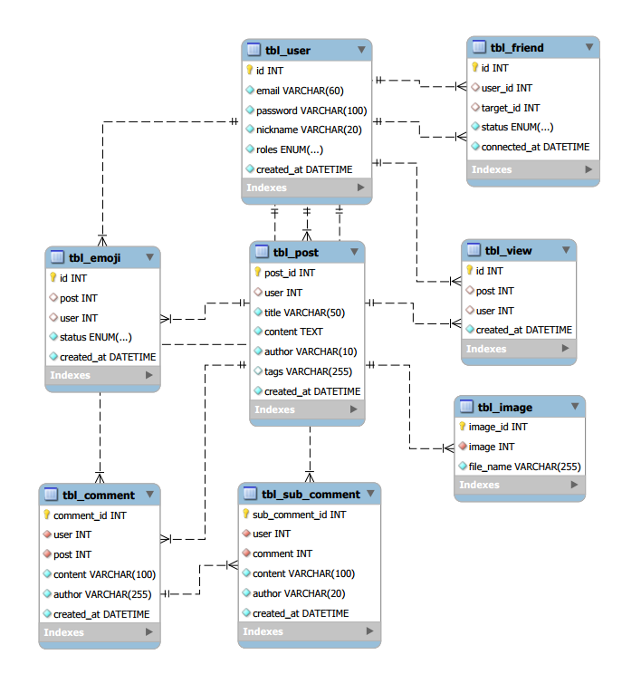

# DMeista 

>  2020-10-22 ~ 2021-04-15 (현재 유지보수 중)

[DMeista API Docs(Swagger)](http://3.36.218.14:8080/swagger-ui.html#/)

`DMeista`는 게시물 포스팅과 이미지 자동태그, 게시물 검색,온라인 친구 관리 등 을 할 수 있는 SNS서비스입니다

### Tech Stack

* Kotlin
* Spring boot, Spring Security,  Spring Data Jpa, Junit5, Swagger, Retrofit
* MySQL, Redis
* Kakao Vision API, Slack API
* Github Actions, AWS(EC2, RDS), Docker, Swarmpit

### DataBase UML
